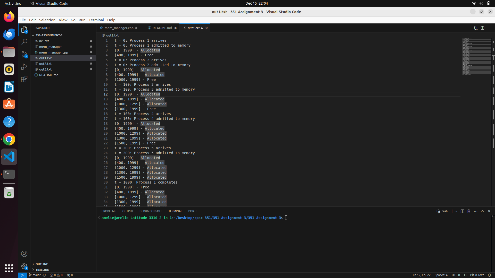

# 351-Assignment-3

# Group members:
- Amelie Gomez, 351-02, ameliegomez24@csu.fullerton.edu
- Robert Moberly, 351-02, rlmoberly91@csu.fullerton.edu
- Luke Makishima, 351-02, LukeMakishima@csu.fullerton.edu

- # Programming Language Used:
- C++

# Group contributions:
- Amelie: Wrote some of the code and made the diagram.
- Luke: Wrote skeleton code.
- Robert: Helped with diagram and with coding.

# Program Running Instructions:
- Linux environment 
- Open command prompt and navigate to the directory with the file mem_manager.cpp
- Enter the command:
```
g++ -o mem_manager mem_manager.cpp
./mem_manager
```

# Screenshot of our Program:

